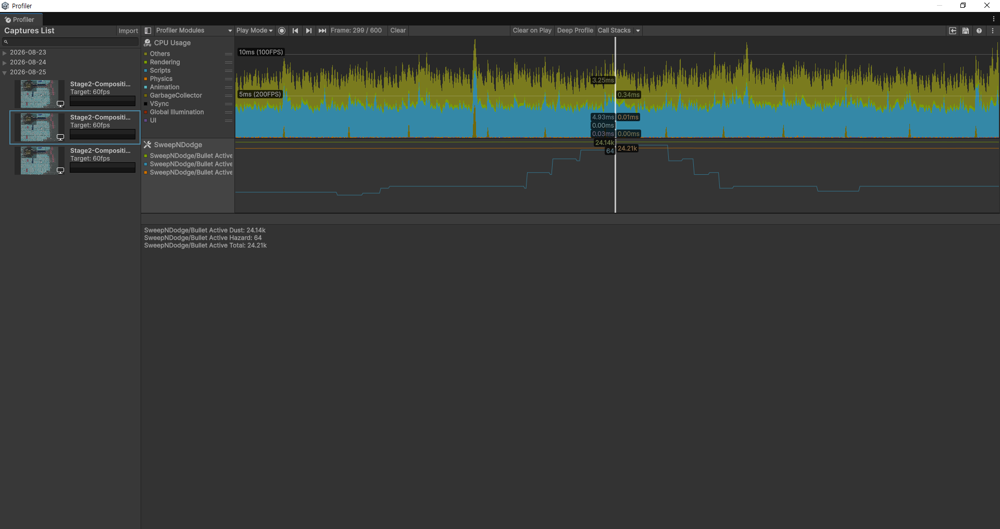

# Stage 2 Standalone Profiling Evidence

> 최신 게임플레이 비주얼을 포함한 동일 Windows standalone Development Build에서 active 구성과 frame interval을 함께 기록한 공개 근거

## Metadata
- doc_id: `PORT-EVIDENCE-STAGE2-PROFILING`
- type: `Portfolio Evidence`
- status: `draft`
- last_updated: `2026-08-28`
- related_docs:
  - [../../PORT-003-validation-report.md](../../PORT-003-validation-report.md)
  - [../PORT-NOTE-002-stage2-standalone-profiling-evidence.md](../PORT-NOTE-002-stage2-standalone-profiling-evidence.md)

## 측정 조건

| Item | Value |
|---|---|
| Unity | 6000.3.6f1 |
| OS | Windows 10 x64 |
| CPU / GPU | Intel Core i5-10400F / NVIDIA GeForce GTX 1650 SUPER |
| Memory | 약 16GB |
| Build | Windows x64, IL2CPP, Development Build, Deep Profile Support Off |
| Display | 1024×768 windowed, VSync Off, uncapped |
| Scene / Stage | `SampleScene` / Stage 2 |
| Scenario | 시작 대화 skip 후 초기 위치, 무입력·무청소 plateau |
| Repetition | 동일 빌드·조건에서 600 frame × 3회 |

## 공개 결과

| Metric | Result |
|---|---:|
| Active Total mean | 24,148.3 |
| Active Total range | 24,077–24,236 |
| Dust / Hazard mean | 24,106.0 / 42.2 |
| Frame interval median / p95 / max | 7.291 / 9.249 / 12.872ms |
| 16.67ms 초과 interval | 0 / 1,797 |
| Tick-proxy pipeline median / p95 / max | 2.058 / 2.408 / 2.745ms |
| Spawn median / p95 / max | 0.392 / 0.618 / 0.771ms |
| `Dust + Hazard = Total` 위반 | 0 / 1,800 frame |
| `WaitForTargetFPS` non-zero | 0 / 1,800 frame |

## Profiler 정지 캡처

### CPU Timeline

600 frame 중 fixed Tick marker가 관찰된 대표 frame 299를 선택했다. 이 이미지는 CPU Timeline과 pipeline 실행 구조를 설명하기 위한 단일 frame 예시이며, 이미지에 보이는 한 frame의 시간을 전체 결과로 일반화하지 않는다. 분포 수치는 위 3-run 집계표를 기준으로 한다.

### Total / Dust / Hazard counter

같은 frame의 counter 이름과 값을 판독하기 위한 보완 이미지다. 이 frame에서는 Dust 약 24.14k, Hazard 64, Total 약 24.21k가 관찰된다. 개별 값은 구성 관계의 예시이며 plateau 평균과 범위는 전체 1,800 frame 집계를 기준으로 한다.

## 연속 영상

공개용 `Stage2-Composition.mp4`는 초반 Stage 선택 구간을 덜어낸 약 22초 편집본을 사용한다. active entity 누적, 약 2.4만 plateau 진입, 15초 이상 유지, HUD의 Total/Dust/Hazard 구성을 보여주는 시각 근거다. 영상의 인코딩 frame rate나 육안상 부드러움은 성능 수치로 사용하지 않는다.

편집 전 25.784533초 원본은 `ProfilerCaptures/Stage2-Composition-full.mp4`에 로컬 보관한다. 공개 영상은 Notion 또는 공개 미디어 전달 위치에서 제공하고 저장소 문서에는 최종 링크를 연결한다.

## 해석 경계

- 약 2.4만 active entity는 일반 플레이의 상시 밀도가 아니라 Stage 2 무청소 누적 plateau다.
- uncapped render frame에는 fixed Tick 실행 frame과 비실행 frame이 섞여 있다.
- 전체 frame median을 ECS fixed Tick 비용 자체로 표현하지 않는다.
- 이 결과는 명시한 장비와 통제 시나리오의 Development Build 결과다.
- 모든 하드웨어와 플레이 상황의 60fps, 최종 공개 Release Build 성능, GameObject 방식 대비 우위를 주장하지 않는다.
- raw `.data`, frame CSV와 내부 manifest는 로컬 재분석 근거로 보존하며 기본 공개 패키지에는 포함하지 않는다.
