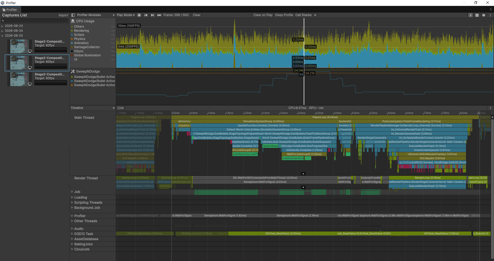

# 대량 엔티티 누적 시나리오 프로파일링 결과

이 문서는 최신 게임플레이 비주얼을 포함한 Windows standalone Development Build에서 Active Entity 구성과 Frame Interval을 함께 기록한 공개 측정 자료입니다.

공개 데모의 Stage 2 시작 대화를 건너뛴 뒤 초기 위치에서 입력과 청소를 수행하지 않았습니다. Dust가 Spawn과 Lifetime Despawn의 균형에 도달한 Plateau 구간을 동일한 빌드와 조건에서 600 Frame씩 3회 기록했습니다.

## 측정 조건

| 항목 | 값 |
|---|---|
| Unity | 6000.3.6f1 |
| 운영체제 | Windows 10 x64 |
| CPU / GPU | Intel Core i5-10400F / NVIDIA GeForce GTX 1650 SUPER |
| Memory | 약 16GB |
| Build | Windows x64, IL2CPP, Development Build, Deep Profile Support Off |
| Display | 1024×768 Windowed, VSync Off, Uncapped |
| Scene / Stage | `SampleScene` / Stage 2 |
| Scenario | 시작 대화 Skip 후 초기 위치, 무입력·무청소 Plateau |
| Repetition | 동일 빌드·조건에서 600 Frame × 3회 |

## 측정 결과

| 지표 | 결과 |
|---|---:|
| Active Total mean | 24,148.3 |
| Active Total range | 24,077–24,236 |
| Dust / Hazard mean | 24,106.0 / 42.2 |
| Frame Interval median / p95 / max | 7.291 / 9.249 / 12.872ms |
| 16.67ms 초과 Interval | 0 / 1,797 |
| Tick-proxy Pipeline median / p95 / max | 2.058 / 2.408 / 2.745ms |
| Spawn median / p95 / max | 0.392 / 0.618 / 0.771ms |
| `Dust + Hazard = Total` 위반 | 0 / 1,800 Frame |
| `WaitForTargetFPS` non-zero | 0 / 1,800 Frame |

## CPU Timeline

600 Frame 중 Fixed Tick Marker가 관찰된 Frame 299를 선택했습니다. 이 이미지는 CPU Timeline과 Pipeline의 실행 구조를 설명하기 위한 단일 Frame 예시입니다.

이미지에 보이는 한 Frame의 시간을 전체 결과로 일반화하지 않으며, 시간 분포는 위의 3회 집계표를 기준으로 합니다.

## Total·Dust·Hazard 구성

CPU Timeline과 같은 Frame에서 Counter 이름과 값을 판독하기 위한 이미지입니다. 이 Frame에서는 Dust 약 24.14k, Hazard 64, Total 약 24.21k가 관찰됩니다.

이 값은 구성 관계를 보여주는 한 Frame의 예시이며, Plateau의 평균과 범위는 전체 1,800 Frame 집계를 기준으로 합니다. 코드에서 사용하는 기존 `Bullet Active` 명칭은 위험 요소뿐 아니라 청소·수집 대상도 포함하므로, 공개 결과에서는 Total을 Dust와 Hazard로 나누어 기록했습니다.

## 해석 범위

- 약 2.4만 개의 Active Entity는 일반 플레이의 상시 밀도가 아니라 Dust를 청소하지 않고 누적한 Plateau입니다.
- Uncapped Render Frame에는 Fixed Tick이 실행된 Frame과 실행되지 않은 Frame이 섞여 있습니다.
- 전체 Frame Median을 ECS Fixed Tick 자체의 비용으로 표현하지 않습니다.
- 이 결과는 명시한 장비와 통제 시나리오의 Development Build 결과입니다.
- 모든 하드웨어와 플레이 상황의 60fps, 최종 Release Build 성능 또는 GameObject 방식 대비 우위를 주장하지 않습니다.

Raw Profiler Data와 Frame CSV, 내부 Build Manifest는 재분석을 위해 로컬에 보존하고 있습니다. 공개 저장소에는 결과를 판독하는 데 필요한 집계표와 이미지까지만 포함합니다.

[검증 자료 안내로 돌아가기](../README.md)
